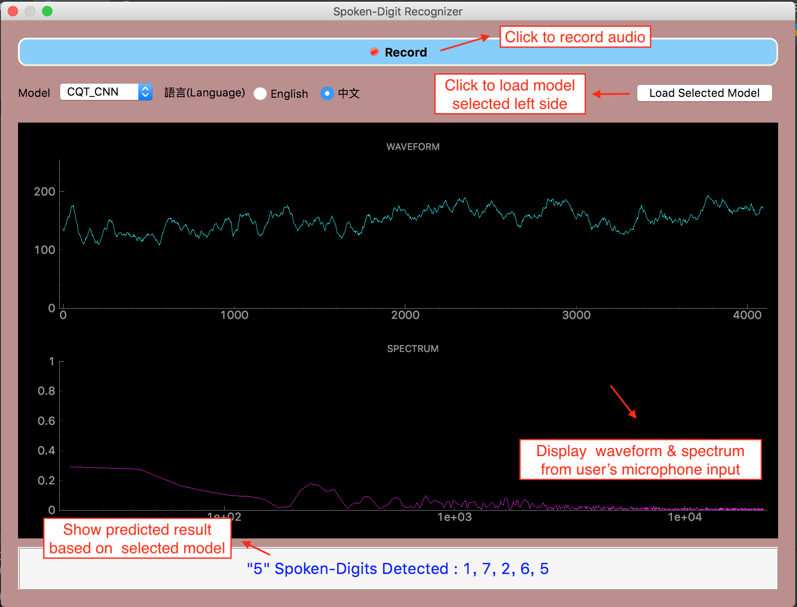

  
  <h2 align="center">語音數字辨識專案 (Spoken-Digit Recognizer)</h2>
  

    本project旨在運用Keras建立Model，辨識使用者說的中/英數字，並使用GUI呈現。
  

## 先看段Demo吧
### [Demo影片 (Spoken-Digit Recognizer)](#)
這邊應該要是個GIF，先用照片擋著用

## Dataset（英文）
- [pannous on github](https://github.com/pannous/tensorflow-speech-recognition?fbclid=IwAR1tThhKhbMM_BnKE4SK16qcbuGdw1gJw7iWVVyEhDk9vZFF5Z8E6rjuWUs)
    - 連結內spoken_numbers_pcm.tar含2400筆.wav檔，為15位不同人唸英文數字0~9的單數字音檔（160/人）。
- 3位contributer每人自錄160筆，與上述相加共2880筆

## Dataset（中文）
- 3位contributer每人自錄500筆，共1500筆
    - 每筆data為中文數字數字0~9單數字音檔，每人一個數字錄50筆

## 目標
1. 使用者對麥克風説一串中/英文數字(0~9)，程式能辨識使用者說了哪些數字  
2. 使用生成對抗網路GAN來生成音檔，即讓程式產出數字0~9的音檔

## Implementation
對目標1.，先將包含多數字的音檔分割，再使用不同種model來辨識，詳細介紹請點連結
- ### [Split_Audio](https://nbviewer.jupyter.org/github/wenya-chungyuan-jauhhsiang/Spoken-Digit-Recognizer/blob/master/docs/split_audio.ipynb)
- ### [Spectrogram + CNN](https://nbviewer.jupyter.org/github/wenya-chungyuan-jauhhsiang/Spoken-Digit-Recognizer/blob/master/docs/Spectrogram_CNN_doc.ipynb)    
- ### [MFCC + RNN](#)

對目標2.，使用inverse-STFT方式，詳細介紹請點連結
- ### [GAN](#)

## 問題討論
### 1. 聲紋影響
    - 一個沒有經過我們model訓練過的人聲，若進行辨識測驗時的平均正確率會較低
    - 我們認為這和聲紋息息相關，也就是同樣的字由不同人發聲的訊號頻譜存在差異
### 2. 中/英文
    - 我們初期是以英文數字為輸入音訊，後期則發現英文其實在發音上相較中文有更多的變化性，如某些子音的發音屬於清音，會較容易被誤判為靜音
    - 英文對於發音並沒有制式的音調規則，例如有些字會因語氣不同而音調不同，這導致我們model的辨識正確率並不理想
    - 後來我們選擇嘗試中文，由於中文絕大多數發音是濁音，且抑揚頓挫已有明確定義，因此訓練出的model辨識正確率果然如我們預期，有明顯的提升

## Contributer
[WenYa Lin](https://github.com/wenyalintw)、[ChungYuan Hsu](https://github.com/ChungYuanHsu)、[JauhHsiang Lan](https://github.com/r07522749)